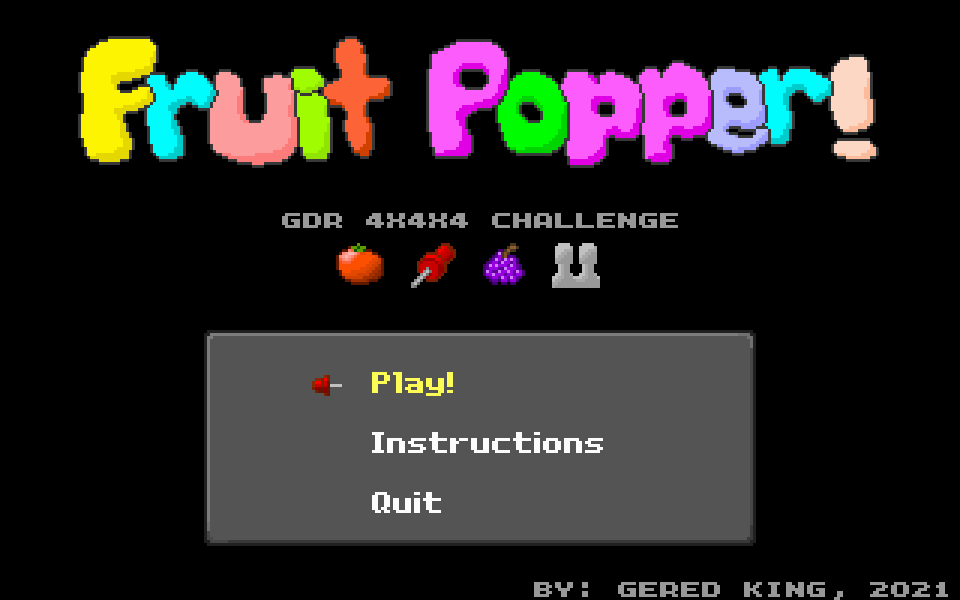
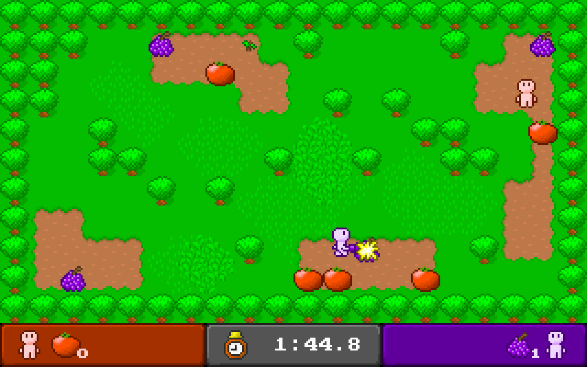

# Fruit Popper!

The was my entry for the most recent (June 2021) 
[GDR 4x4x4 Challenge](http://noop.rocks/gdr/viewtopic.php?f=2&t=46).

You can see my [development log entries here](http://noop.rocks/gdr/viewtopic.php?f=5&t=57).

Additionally, I wrote a sort of [post-mortem of the project here](http://blarg.ca/2021/07/18/fruit-popper/).

"Fruit Popper" is a two-player game developed for MS-DOS. A 486 PC with VLB graphics card is 
recommended for best performance. 

In this game you square off against your opponent to see who can pop the most fruit (tomatoes and
grapes only!) with your trusty magically attuned thumb-tack!

